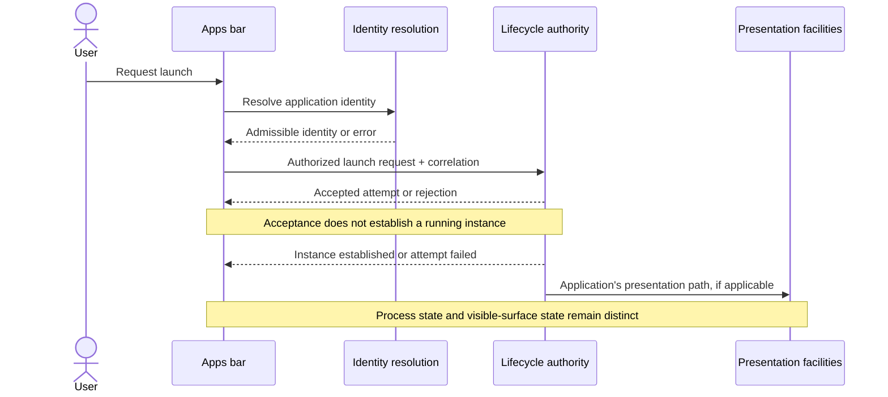

# MochiOS desktop elaboration

This is a worked design example for Full Stack, not an approved MochiOS architecture change or a complete implementation audit. The selected illustrative increment is **launch a registered application from the apps bar and display an honest lifecycle indication**. Proposed names below describe logical responsibilities; they do not imply new processes, crates, or existing API symbols.

## Observed source material

On 2026-09-09, the repository HEAD read `e3c0da6b6bb7b03bddf3015d9f7ad238c9dc21b8`. This does not imply a clean working tree or runtime validation.

| Source | What inspection establishes | What it does not establish |
|---|---|---|
| [HTML concept](../../../MochiOS/docs/design/desktopbrainstorm/appsbar-concept.html) | `APPS` at line 175; `AppsBar()` at 242; `Scene()` at 268; running indication derives from mock `app.running` | A real registry, lifecycle observation, persistence, or launch path |
| [App-bar brainstorm](../../../MochiOS/docs/design/desktopbrainstorm/appbar.md) | Discusses shell/compositor/application responsibilities and later identifies additional gaps | That its proposed service inventory is current architecture or approved scope |
| [Root contract](../../../MochiOS/docs/architecture/SYSTEM.md) | Existing Recurspec tree and governing architecture reference | Runtime enforcement of every written requirement |
| [Interface contract](../../../MochiOS/docs/architecture/interface/SYSTEM.md) | References compositor, input, UI framework, scanout, and audio concerns | That target placement and guarantees have all been implemented |
| [Userspace contract](../../../MochiOS/docs/architecture/userspace-habitat/SYSTEM.md) | References runtime, supervision, session routing, shell surface, component architecture | Correctness of all linked services |
| [Cargo workspace](../../../MochiOS/Cargo.toml) | Rust workspace membership and existing platform/user-space organization | Dependency availability for an arbitrary Linux/Rust library |

The example stops at this evidence boundary. A real invocation would inspect the relevant implementation symbols before choosing concrete providers. It would preserve MochiOS's governing contracts rather than install the brainstorm's service list over them.

## Domain distinctions

| Concept | Proposed definition for this example |
|---|---|
| Application identity | Stable identity of an application the system can resolve; exact mapping to MochiOS admitted contracts must be investigated |
| Application instance | A specific execution lifecycle associated with an application identity |
| Process | An execution container; not assumed to correspond one-to-one with an application |
| Window/surface | Presentation entity; existence or visibility is not identical to process existence |
| Launch attempt | Correlated request to establish an application instance; acceptance is distinct from completion |
| Pinned entry | Persistent user preference referring to an application identity; pinning is outside this increment unless already required |
| Running indication | A projection of defined lifecycle evidence, not a boolean toggled optimistically on click |

“Launch,” “activate,” and “focus” need different semantics. This increment launches an application; handling a click on an existing instance requires a stated policy rather than silently inventing a multi-window chooser.

## Wider concept inventory and bounded selection

The initial desktop inventory could include apps bar, top bar, workspace, desktop items, application lifecycle, surface management, resources, storage, and session behavior. That inventory is a navigation aid, not authorization to implement every item.

| Item | Disposition for this illustrative increment | Reason |
|---|---|---|
| Apps-bar launch interaction and feedback | Required now | Selected user outcome |
| Application identity resolution and authorized launch | Unresolved prerequisite until mapped to actual providers | UI alone cannot establish execution |
| Lifecycle observation and reconciliation | Unresolved prerequisite until provider semantics are inspected | Needed for honest indication |
| Existing shell surface/composition/input facilities | Existing documented dependencies, execution unverified here | Referenced by current architecture |
| Top-bar redesign, previews, badges, drag-and-drop | Deferred enhancements | Do not establish the selected launch behavior |
| Application installation and package updates | Deferred enhancements | Increment assumes already registered applications |
| Desktop-file enumeration/open-with | Deferred enhancement for this increment | Separate user outcome, elaborated below as a future example |

## Candidate responsibility allocation

| Responsibility | Authority | Derived consumers | Current mapping |
|---|---|---|---|
| Apps-bar presentation | Visible pending/error state and layout policy | Shell renderer | Start from existing shell-surface owner; inspect before selecting code locations |
| Application identity resolution | Mapping from public identity to admissible executable metadata | Apps bar, future file associations | Open mapping to governing admitted-contract design |
| Application lifecycle | Accepted launch attempts and instance transitions | Apps bar and other observers | Inspect execution/supervision responsibilities; do not invent a duplicate manager |
| Surface/focus behavior | Authority and policy explicitly allocated between existing owners | Apps bar requests activation where supported | Inspect compositor/input/shell contracts before adding policy |

One provider may implement several rows. Several internal modules may implement one row. The table assigns semantic responsibilities, not runtime topology.

## Launch interaction

The target flow is proposed:

The diagram intentionally does not name a transport or concrete function. A real design must resolve these against available APIs. The lifecycle event and presentation ordering shown are conceptual; actual scheduling and observation semantics must be specified before implementation.

The important contract obligations are:

- A rejected launch never produces a false running indication.
- Pending feedback is tied to an identifiable attempt, with a defined terminal failure path.
- A successful launch and subsequent exit can be associated with the correct instance.
- Duplicate clicks have an explicit policy; a plausible initial proposal is to avoid duplicate pending requests for the same selected entry, subject to multi-instance requirements.
- If observation is lost, the consumer resynchronizes through supported provider semantics or displays unknown state. It does not retain invented certainty.
- If surface creation fails after process creation, the lifecycle and presentation outcomes remain separately describable.

These are proposed obligations, not measured behavior or formal proof. Numeric latency targets remain unspecified until the product requirement or a baseline supplies them.

## Example apps-bar specification

**Responsibility:** present application entries and route the selected launch interaction through existing system authority, reflecting observed outcome state.

**Does not own:** executable loading, authorization policy, instance supervision, global focus truth, or application installation.

**State:** transient selection, pending attempts, displayed error, and derived lifecycle projection. Persistent pins are only included if selected or already supplied by an existing contract. A derived projection must name its source and invalidation/resynchronization behavior.

**Interfaces:** identity resolution, launch request/outcome, and lifecycle observation. A pure rendering function can consume a view model, but the view model's origin and evidence semantics remain part of the design. The transport, ordering guarantees, and concrete types are unresolved until provider inspection.

**Acceptance examples:** rejected authorization clears pending feedback; failed launch reports failure; observed exit clears the indication for that instance; reconnect cannot silently preserve stale truth; repeated clicks follow the chosen duplication policy. Tests against doubles are useful at the contract seam; a separate real launch/exit integration check is required to claim operational behavior.

**Readiness:** this is sufficient to identify responsibilities and investigate provider seams. It is not yet an implementation-ready MochiOS handoff because concrete provider contracts and identity mapping have not been verified.

## Illustrative delivery sequence

This sequence demonstrates work-package derivation. It is not a second MochiOS roadmap.

1. Inspect existing identity, launch, supervision, and observation paths; resolve provider/consumer contracts and map them to governing architecture.
2. Specify a minimal apps-bar state projection and its failure/reconciliation behavior against those contracts.
3. Integrate one already registered application through the actual launch and lifecycle path.
4. Exercise launch rejection, launch failure, exit, and observation loss with the smallest convincing real/double test combination; label each evidence boundary.

Only then expand to another selected outcome. Current ROADMAP IDs should be reused in a real run; none are invented by this example.

## How the other desktop concepts would be elaborated

**Top bar:** start from a selected status task, such as reading volume and requesting a change. Separate displayed value, source authority, authorization, change acknowledgment, and failure feedback. Do not assume the widget owns the audio device. Network, power, and clock behavior can be separate outcomes with shared presentation conventions.

**Desktop space:** distinguish a workspace from its wallpaper and from the namespace rendered as desktop icons. Identify who owns placement and selection, which state persists, and how display or scale changes affect layout. A concept document can describe the combined user experience while linking distinct owners.

**Loading desktop files:** trace initial enumeration, item identity, metadata/icon resolution, updates, and open requests. Define the boundary between namespace access and file contents. An open request needs an authority check and a target application, but a filesystem need not interpret shell icon positions. Missing resources, moved/deleted entries, and permission changes are candidate scenarios to assess against the chosen milestone.

For an actual multi-concept assignment, create individual concept documents for these outcomes and link shared interface definitions to the existing `SYSTEM.md` owners. File names such as `appbar.md` and `top-bar.md` are fine for concept narratives; Recurspec's normative contracts retain their required names. This preserves discoverability without creating competing sources of architectural truth.
